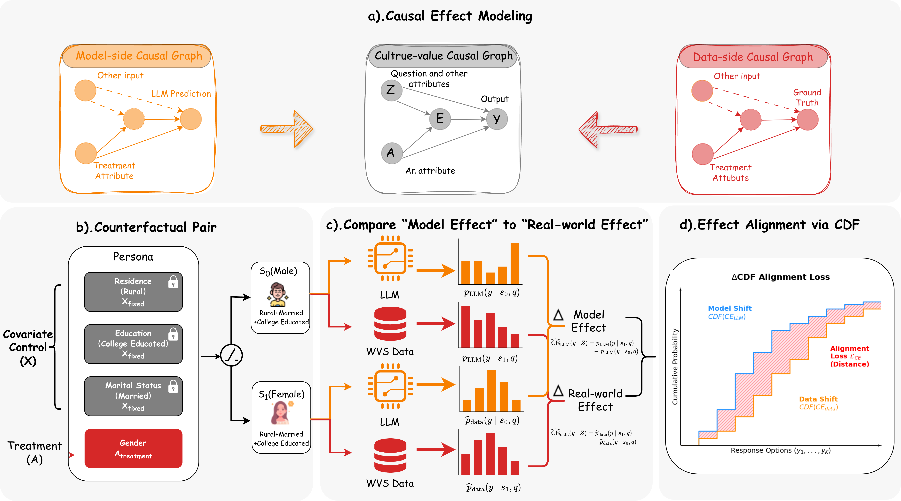

# ACE-Align

Official implementation of **ACE-Align: Attribute Causal Effect Alignment for
Cultural Values under Varying Persona Granularities**.

ACE-Align trains and evaluates a LoRA adapter for survey-distribution
simulation. It aligns the response shifts induced by controlled demographic
attribute edits with the corresponding shifts observed in human survey data.

## Method Overview

<p align="center">
  
</p>

ACE-Align constructs counterfactual persona pairs by changing one treatment
attribute while holding the remaining persona attributes fixed. It then
compares the resulting model-side and data-side response shifts and minimizes
their distance in cumulative-distribution space.

## Repository Contents

The public code is intentionally minimal:

- Training uses a two-stage objective schedule: answer anchoring first,
  distribution alignment second.
- EMD is the only evaluation metric reported.
- Data files are named by country, for example `data/train/australia.jsonl`.
- Historical probes, logs, and intermediate experiment names are not included.

## Directory

```text
.
├── assets/
│   └── ace-align-framework.png # Method overview
├── configs/default.env          # Local paths and run defaults
├── data/
│   ├── train/                   # Per-country training jsonl files
│   └── eval/                    # Per-country evaluation data
├── scripts/
│   ├── build_all_train.py       # Concatenate country files for training
│   ├── train.sh                 # Train LoRA
│   ├── evaluate.sh              # vLLM inference + EMD evaluation
│   ├── evaluate_torch.sh        # PyTorch fallback inference
│   └── summarize.sh             # Export CSV tables
├── src/
│   ├── train.py
│   ├── infer_eval.py
│   ├── infer_eval_vllm.py
│   └── summarize.py
└── requirements.txt
```

## Environment

Create an environment with PyTorch matching your CUDA version, then install:

```bash
pip install -r requirements.txt
```

Edit `configs/default.env`:

```bash
BASE_MODEL=/path/to/Llama-3.1-8B-Instruct
TOKENIZER_PATH=/path/to/Llama-3.1-8B-Instruct
```

The scripts also accept environment variable overrides, so you can avoid editing
the file:

```bash
BASE_MODEL=/path/to/model TOKENIZER_PATH=/path/to/model bash scripts/train.sh
```

## Train

Build the generated all-country training file:

```bash
python scripts/build_all_train.py
```

Run training:

```bash
bash scripts/train.sh
```

The default output is:

```text
outputs/causal/final
```

During training, each epoch is saved as a LoRA adapter:

```text
outputs/causal/
├── epoch-1/
├── epoch-2/
└── final/
```

With the default `NUM_EPOCHS=2`, training runs one objective at a time:

```text
epoch-1: anchor objective, 0 -> 1
epoch-2: distribution objective, 1 -> 0
```

The anchor objective trains the model toward each subgroup's modal answer.
The distribution objective aligns the modeled distribution shift with the
observed distribution shift. `final` is the last checkpoint copied under a
stable name for inference.

Important defaults:

```text
num_epochs = 2
objective_schedule = anchor,distribution
learning_rate = 2e-5
LoRA rank/alpha = 16/32
batch size per device = 8
GPUs = 0
num_processes = 1
```

Training is single-GPU by default. To run on a different single GPU, set
`GPUS`, for example:

```bash
GPUS=1 bash scripts/train.sh
```

## Evaluate

Run vLLM inference and EMD evaluation:

```bash
ADAPTER_PATH=outputs/causal/final bash scripts/evaluate.sh
```

Evaluation is single-GPU by default. To split countries across multiple GPUs,
set `GPU_LIST`, for example `GPU_LIST="0 1 2 3"`.

The script writes:

```text
results/predictions/<model_name>/
results/reports/<model_name>/
logs/eval_*/
```

Export CSV summaries:

```bash
bash scripts/summarize.sh
```

The CSV files are:

```text
results/csv/<model_name>/summary.csv
results/csv/<model_name>/long.csv
```

`summary.csv` reports `100 * (1 - EMD)` for each country and attribute
dimension. Higher is better.

If vLLM is unavailable on a machine, use the PyTorch fallback:

```bash
ADAPTER_PATH=outputs/causal/final bash scripts/evaluate_torch.sh
```

Use `MODEL_NAME` to keep different base models or checkpoints separate:

```bash
MODEL_NAME=llama3_causal ADAPTER_PATH=outputs/llama3/final bash scripts/evaluate.sh
MODEL_NAME=qwen_causal ADAPTER_PATH=outputs/qwen/final bash scripts/evaluate.sh

MODEL_NAME=llama3_causal bash scripts/summarize.sh
MODEL_NAME=qwen_causal bash scripts/summarize.sh
```

## Data Naming

Countries use lowercase snake-case slugs:

```text
australia
chile
egypt
ethiopia
germany
great_britain
india
japan
mexico
new_zealand
nigeria
philippines
russia
united_states
```

This keeps the public data layout compact while preserving the original
country-level semantics.
